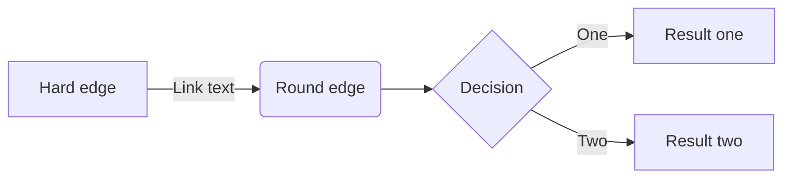

# poc-spring-graphql

    http://localhost:8080/h2/login.jsp 

    http://localhost:8080/swagger-ui/

    http://localhost:8080/actuator  

### Protocol Buffers
Caso os import’s do arquivo .proto não estejam sendo reconhecidos devemos ajustar a configuração da pasta “proto” no “setting” do IDE.

### Referência 
https://github.com/profdiovani/mbari

https://developers.google.com/protocol-buffers/docs/proto3

